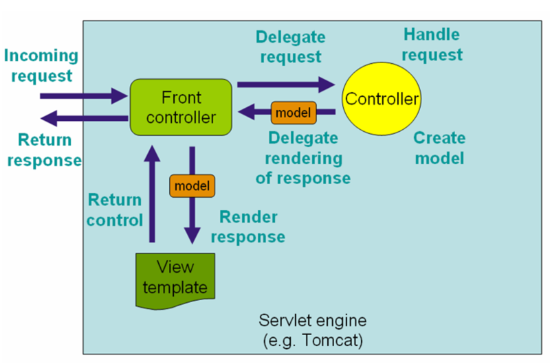

# Spring
- `Spring` 是一个 Java 开发框架，它提供了一种全面的编程和配置模型。
- `Spring` 的目标是简化企业级应用程序的开发，提高开发人员的生产力。
- `Spring` 的本质是 `Spring Container`，是一个容器框架，用于管理 Java 项目中的对象的生命周期和配置。
- 其中，被 Spring 管理的 Java 对象称为 `Bean`。
- `Spring` 的核心是 `IoC` 和 `AOP`。
  1. `控制反转 - Spring IoC`，它负责管理 Bean 的生命周期。
  2. `面向切面编程 - Spring AOP`，它负责管理 Bean 的配置。
- 这两个特性使得 Spring 框架更加灵活、可维护、可扩展。

## Spring IoC
- `IoC` 是 `Inversion of Control` 的缩写，即控制反转。
- `IoC` 是一种设计模式，它将对象的创建和对象之间的依赖关系的管理交给了容器。
- 主要是为了将对象之间的依赖关系从程序代码中解耦，使得程序更加灵活、可维护、可扩展。
- Spring IoC 容器负责管理 Bean 的生命周期，包括 Bean 的创建、初始化、使用和销毁。
- Spring IoC 容器有两种实现方式：`BeanFactory` 和 `ApplicationContext`。

## Dependency Injection
- `DI` 是 `Dependency Injection` 的缩写，即依赖注入。
- `DI` 是 `IoC` 的一种实现方式，它是一种设计模式，用于管理对象之间的依赖关系。

## Spring AOP
- `AOP` 是 `Aspect Oriented Programming` 的缩写，即面向切面编程。

## 三层架构
- 三层架构是一种软件架构模式，将 Web 应用程序的开发过程（代码）分为三个独立的层次：
1. 表现层（View）：负责接收请求，返回响应。
2. 业务层（Service）：负责处理业务逻辑。
3. 持久层（Dao）：负责与数据库交互。

## Spring MVC
- `Spring MVC` 是 `Spring` 框架中，用于实现 `表现层` 的设计模式：
- `MVC`
  1. `Model`：负责处理业务逻辑。
  2. `View`：负责显示数据。
  3. `Controller`：负责处理请求，返回响应。
- 流程：
  1. 用户访问浏览器，浏览器会向服务器发送请求。
  2. `Controller` 最先接收到浏览器发送的请求，同时会调用业务层的 `Service`
  3. `Service` 层会处理业务逻辑，返回数据给 `Controller`
  4. `Controller` 会将从 `Service` 层返回的数据，打包成一个 `Model` 对象，传递给 `View` 层
  5. `View` 将 `Model` 对象中的数据，生成 HTML 页面，返回给浏览器
- `Spring MVC` 的核心是 `DispatcherServlet`，它负责接收请求，分发请求，调用 `Controller` 处理请求，返回响应。

## 三层架构
1. Controller 层：处理请求，返回响应。
2. Service 层：处理业务逻辑。
3. Dao 层：与数据库交互。

## 三层架构的依赖关系
- Controller 层调用 Service 层，Service 层调用 Dao 层
- 则，Controller 层依赖 Service 层，Service 层依赖 Dao 层
- 在开发时，我们倒着实现，先实现 Dao 层，再实现 Service 层，最后实现 Controller 层

## Thymeleaf
- `Thymeleaf` 是一种模板引擎。
- 接受 `模版文件` 与 `Model` 对象中的数据，生成动态的 HTML 页面。

## MyBatis
- `MyBatis` 是一种持久层框架，用于与数据库交互。
- `MyBatis - Spring` 整合，可以简化数据库操作。

### MyBatis 核心组件
1. `SqlSessionFactory` 用于创建 `SqlSession` 对象。
2. `SqlSession` 用于执行 SQL 语句。
3. `xml` 配置文件：用于配置 SQL 语句。
   - `SqlSessionFactory`， `SqlSession`，`.xml` 文件，这三个组件在 Spring 中整合，不需要手动创建。
4. `Mapper 接口` / `DAO 接口` ：用于定义 SQL 语句。
   - 只需要定义接口，不需要实现接口，MyBatis 会自动为接口生成实现类。
5. `Mapper 映射器 / Mapper.xml` ：用于编写 SQL 语句，并将 SQL 和实体类映射的组件。
   - 示例：使用 MyBatis 对用户表进行 CRUD 操作。